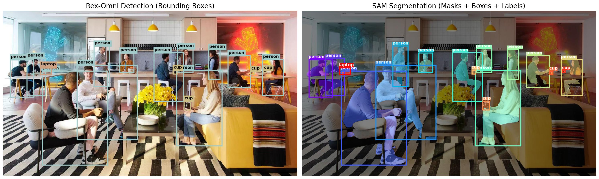

# Rex-Omni + SAM Integration

Combine **Rex-Omni's** language-driven detection with **SAM's** precise segmentation for accurate object detection and pixel-perfect masks.

## 🎯 What It Does

1. Use Rex-Omni to detect objects with natural language
2. Feed detected bounding boxes to SAM as prompts
3. Get precise segmentation masks for each object

## 📊 Visualization



*Left: Rex-Omni detection with bounding boxes | Right: SAM segmentation with masks, boxes and labels*

## 📋 Requirements

```bash
# Install Rex-Omni
pip install -e .

# Install SAM
pip install git+https://github.com/facebookresearch/segment-anything.git

# Download SAM checkpoint (choose one)
wget https://dl.fbaipublicfiles.com/segment_anything/sam_vit_h_4b8939.pth  # Highes(~375MB)
```

## 🚀 Usage

### Basic Example

```bash
CUDA_VISIBLE_DEVICES=0 python applications/_1_rexomni_sam/rexomni_sam_demo.py \
    --image tutorials/detection_example/test_images/cafe.jpg \
    --categories person cup laptop \
    --rex-model IDEA-Research/Rex-Omni \
    --sam-checkpoint sam_vit_h_4b8939.pth \
    --sam-model vit_h \
    --backend transformers \
    --output output_cafe.jpg
```

## 📝 Python API

```python
from applications._1_rexomni_sam.rexomni_sam_demo import rex_sam_pipeline

results = rex_sam_pipeline(
    image_path="your_image.jpg",
    categories=["person", "car", "dog"],
    sam_checkpoint="sam_vit_h_4b8939.pth",
    output_path="output.jpg"
)

# Access results
predictions = results["predictions"]  # Rex-Omni detections
masks = results["masks"]              # SAM masks
scores = results["scores"]            # Mask confidence scores
boxes = results["boxes"]              # Bounding boxes
```

## 🔧 Options

| Argument | Description | Default |
|----------|-------------|---------|
| `--image` | Input image path | `tutorials/detection_example/test_images/cafe.jpg` |
| `--categories` | Categories to detect (space-separated) | `person cup laptop` |
| `--sam-checkpoint` | Path to SAM checkpoint | `None` |
| `--sam-model` | SAM model type: `vit_h`, `vit_l`, `vit_b` | `vit_h` |
| `--rex-model` | Rex-Omni model path | `IDEA-Research/Rex-Omni` |
| `--backend` | Rex-Omni backend: `transformers`, `vllm` | `transformers` |
| `--output` | Output visualization path | `output_visualization.jpg` |
| `--no-individual` | Don't save individual masks | `False` |

## 📚 References

- **Rex-Omni**: [GitHub](https://github.com/IDEA-Research/Rex-Omni)
- **SAM**: [GitHub](https://github.com/facebookresearch/segment-anything)
