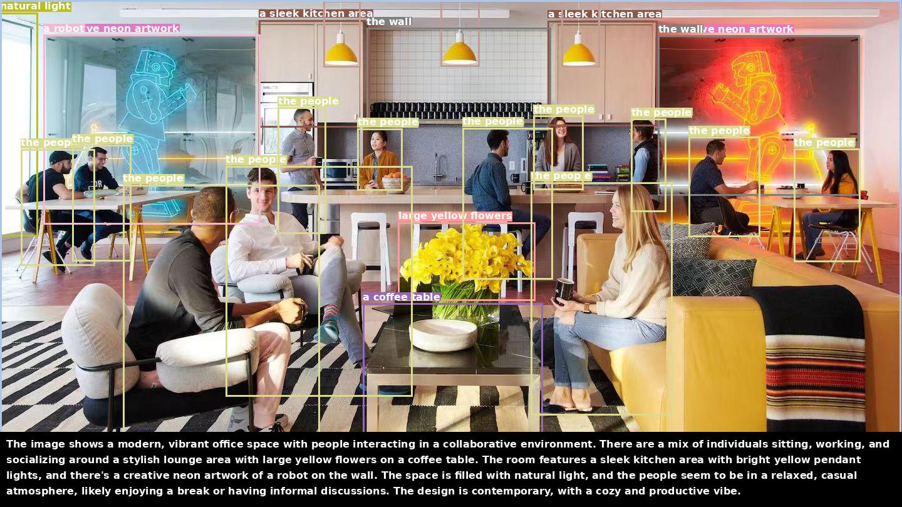

# Automatic Grounding Data Engine

Automatically generate phrase grounding annotations from image captions using spaCy and Rex-Omni.

## 🎯 What It Does

1. **Extract phrases** from captions using spaCy's noun phrase chunking
2. **Ground phrases** using Rex-Omni's detection capabilities  
3. **Generate annotations** with character-level spans and bounding boxes
4. **Save to JSONL** format for training grounding models

## 📊 Visualization



*Top: Groudning visualization results | bottom: Inpu caption*

## 📋 Requirements

```bash
# Install Spacy
pip install spacy
python -m spacy download en_core_web_sm
```

## 🚀 Usage

### Basic Example

```bash
CUDA_VISIBLE_DEVICES=0 python applications/_2_automatic_grounding_data_engine/gd_data_engine.py \
    --images tutorials/detection_example/test_images/cafe.jpg \
    --captions "The image shows a modern, vibrant office space with people interacting in a collaborative environment. There are a mix of individuals sitting, working, and socializing around a stylish lounge area with large yellow flowers on a coffee table. The room features a sleek kitchen area with bright yellow pendant lights, and there's a creative neon artwork of a robot on the wall. The space is filled with natural light, and the people seem to be in a relaxed, casual atmosphere, likely enjoying a break or having informal discussions. The design is contemporary, with a cozy and productive vibe." \
    --output-jsonl my_grounding_data.jsonl  \
    --output-dir applications/_2_automatic_grounding_data_engine
```


## 📊 Output Format

### JSONL Annotations

Each line in the output JSONL file contains:

```json
{
  "image": "path/to/image.jpg",
  "caption": "A cat sitting on a table with a laptop",
  "width": 1920,
  "height": 1080,
  "phrases": [
    {
      "phrase": "a cat",
      "start_char": 0,
      "end_char": 5,
      "boxes": [
        {
          "bbox": [100, 150, 300, 400],
        }
      ]
    },
    {
      "phrase": "a table",
      "start_char": 17,
      "end_char": 24,
      "boxes": [
        {
          "bbox": [50, 500, 800, 900],
        }
      ]
    }
  ]
}
```


## 🔧 Options

| Argument | Description | Default |
|----------|-------------|---------|
| `--images` | List of image paths | None |
| `--captions` | List of captions (must match images) | None |
| `--input-json` | Input JSON file with image-caption pairs | None |
| `--rex-model` | Rex-Omni model path | `IDEA-Research/Rex-Omni` |
| `--backend` | Rex-Omni backend: `transformers`, `vllm` | `transformers` |
| `--output-jsonl` | Output JSONL file path | `grounding_annotations.jsonl` |
| `--output-dir` | Output directory for visualizations | `grounding_visualizations` |
| `--no-visualize` | Don't save visualizations | `False` |

## 📝 Python API

```python
from applications._2_automatic_grounding_data_engine.gd_data_engine import batch_process_images

# Prepare your data
image_caption_pairs = [
    ("image1.jpg", "A cat on a table"),
    ("image2.jpg", "A dog in the park"),
]

# Generate grounding annotations
batch_process_images(
    image_caption_pairs=image_caption_pairs,
    rex_model_path="IDEA-Research/Rex-Omni",
    output_jsonl="my_annotations.jsonl",
    output_dir="my_visualizations",
    visualize=True
)
```

## 🎓 How It Works

### Step 1: Phrase Extraction
```python
import spacy
nlp = spacy.load("en_core_web_sm")

caption = "A cat sitting on a table"
doc = nlp(caption)

# Extract noun phrases
phrases = [(chunk.text, chunk.start_char, chunk.end_char) 
           for chunk in doc.noun_chunks]
# Result: [("A cat", 0, 5), ("a table", 17, 24)]
```

### Step 2: Phrase Grounding
```python
from rex_omni import RexOmniWrapper

rex_model = RexOmniWrapper(model_path="IDEA-Research/Rex-Omni")
results = rex_model.inference(
    images=image,
    task="detection",
    categories=["a cat", "a table"]
)
```

### Step 3: Annotation Generation
Combines character spans from spaCy with bounding boxes from Rex-Omni to create structured annotations.

## 📚 References

- **Rex-Omni**: [GitHub](https://github.com/IDEA-Research/Rex-Omni)
- **spaCy**: [Website](https://spacy.io/)
- **Phrase Grounding**: GLIP, MDETR, GroundingDINO

